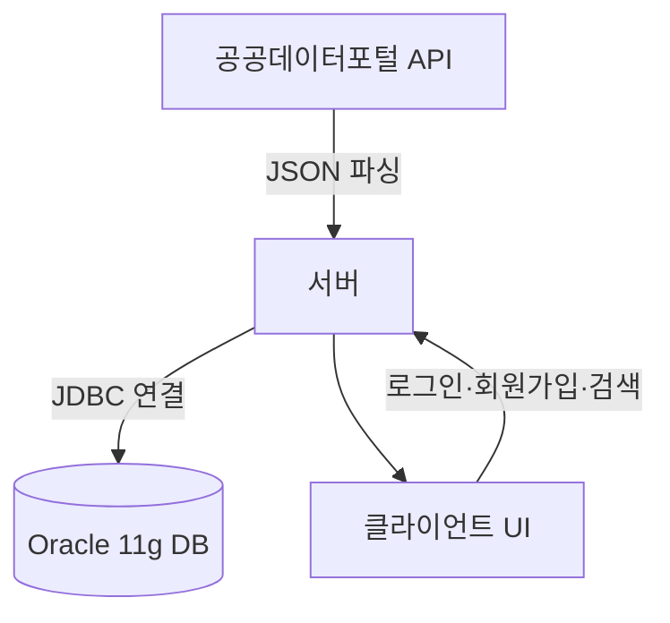

# 🐟 수산물 위판정보 프로그램

> **실시간 수산물 단가 조회**를 통해 효율적인 소비를 돕는 가격 비교 시스템

---

## 📌 프로젝트 개요
- **기간**: 2018.09 ~ 2018.11  
- **개발 환경**: `Eclipse`, `Oracle 11g`  
- **사용 기술**: `Java`, `SQL`, `공공데이터포털 API`, `JDBC`   

---

## 🎯 프로젝트 목적
여러 사이트를 방문할 필요 없이 **한 번에 실시간 수산물 단가**를 확인하고,  
사용자가 보다 합리적인 구매 결정을 할 수 있도록 돕는 **가격 비교 플랫폼**을 구축했습니다.

---

## 🙋‍♂️ 내 기여도

| 역할 | 상세 내용 |
|------|----------|
| **공공 API 데이터 파싱** | JSON 데이터 파싱 및 필요한 필드만 선별, 서버 데이터 가공 로직 구현 |
| **소켓 통신 서버 구축** | 로그인·로그아웃 처리 및 활동 로그 기록 기능 개발 |
| **회원가입 / 로그인 / 로그아웃 기능** | 입력 검증(필수 정보 누락, 중복 체크), DB 저장 로직 구현 |
| **비밀번호 찾기 기능** | 임시 비밀번호 랜덤 생성(`100000~999999`) 및 재설정 유도 프로세스 구현 |

---

## 👥 팀 구성 및 역할 분담
- **본인**: API 연동, 서버 통신, 인증/회원 기능, 비밀번호 찾기 구현
- **팀원**: UI/디자인 제작
- **팀원**: 데이터베이스 설계 및 초기 데이터 입력

---

## 🛠 주요 기능

### 1. 오픈 API 연동
- 공공데이터포털 API에서 `JSON` 형태로 데이터를 수집
- **JSON Parser**를 이용해 필요한 데이터만 가공 및 저장

### 2. 로그인 / 로그아웃
- **소켓 통신 기반 서버**로 로그인/로그아웃 처리
- 접속 및 종료 시 **활동 로그 기록**

### 3. 회원가입
- 필수 정보 누락 시 가입 불가
- **중복 체크** 미완료 시 가입 제한
- 가입 성공 시 사용자 정보를 DB에 저장

### 4. 비밀번호 찾기
- 비밀번호 제공 대신 **6자리 임시 비밀번호**(`100000~999999`) 발급
- 발급 후 비밀번호 재설정 유도

### 5. 가격 검색
- API에서 파싱한 단가 데이터를 직관적인 UI로 표시
- 선택한 어종의 **상세 정보**를 DB에서 조회 및 제공

---

## 🗂 시스템 구조

---
## 📖 배운 점 & 느낀 점
- 공공 API 연동 능력: JSON 데이터 파싱 및 가공 능력 향상
- 네트워크 프로그래밍 경험: 소켓 기반 서버-클라이언트 구조 설계
- 보안 고려: 비밀번호 재설정 및 임시 비밀번호 발급 프로세스 구현
- 이번 프로젝트에서 JDBC와 소켓 통신은 이전에도 경험이 있었기 때문에 비교적 자신 있게 진행할 수 있었습니다. 반면, **공공데이터포털의 오픈API 활용은 처음이어서 걱정이되었습니다.**
- 인증키 오류로 인해 데이터 요청이 실패하는 문제를 겪었지만, 원인을 빠르게 파악하고 해결하면서 문제 해결 능력을 키울 수 있었습니다.
---

## 📷 실행 화면 예시
### 로그인

---
### 오픈API

---
### 회원관리

